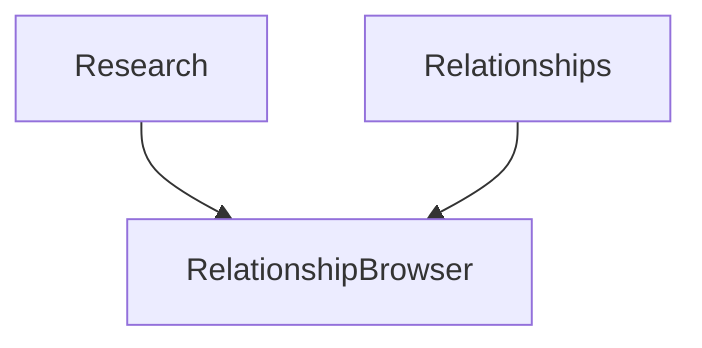

# Dependency Inversion Principle (DIP)

High-level modules should **not** depend on low-level modules.  
Both should depend on **abstractions**.  
Details depend on abstractions — not the other way around.

## Goal

`Research` (high-level) should not dig into `Relationships.relations` (low-level storage).  
It should depend on a `RelationshipBrowser` abstraction.

## Concept

| Term | Meaning |
|------|---------|
| **High-level** | Policy / use case (`Research`) |
| **Low-level** | Storage / mechanism (`Relationships`) |
| **Abstraction** | Shared contract (`RelationshipBrowser`) |
| **DIP** | Depend on the contract, invert the usual “UI → DB” coupling |

## Bad vs Good

### Violation — high-level peeks into low-level guts

```python
class Research:
    def __init__(self, relationships: Relationships):
        for r in relationships.relations:  # coupled to storage shape
            if r[0].name == "John" and r[1] == Relationship.PARENT:
                print(f"John has a child called {r[2].name}")
```

Change how relations are stored → `Research` breaks.

### Compliant — this tutorial

```python
class RelationshipBrowser:
    def find_all_children_of(self, name: str): ...

class Relationships(RelationshipBrowser):
    def find_all_children_of(self, name: str): ...

class Research:
    def __init__(self, browser: RelationshipBrowser):
        for p in browser.find_all_children_of("John"):
            print(f"John has a child called {p}")
```

`Research` only knows the browser API. Storage can change freely.

## This example

| Piece | Role |
|-------|------|
| `Person` / `Relationship` | Domain data |
| `RelationshipBrowser` | Abstraction |
| `Relationships` | Low-level store implementing the browser |
| `Research` | High-level module depending on the abstraction |



Source: [`main.py`](main.py)

## Run

```bash
uv run dip
```

### Expected output

```text
John has a child called Chris
John has a child called Matt
```

## Takeaway

- Don’t let policy code scrape infrastructure internals  
- Put a stable abstraction between them  
- Low-level details implement the abstraction  

## Next

You’ve now covered all five SOLID principles under `solid/`.
