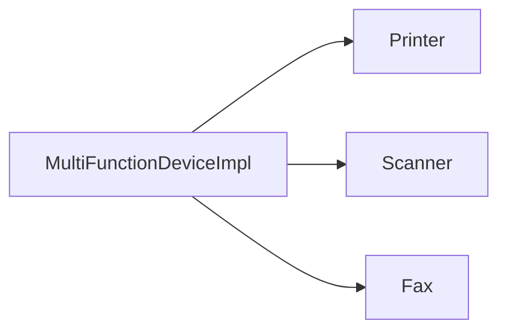

# Interface Segregation Principle (ISP)

Clients should **not** be forced to depend on methods they do not use.  
Prefer **many small interfaces** over one fat interface.

## Goal

A simple printer should only need `print`. It should not fake or raise on `fax` / `scan` just because a mega-`Machine` base requires them.

## Concept

| Term | Meaning |
|------|---------|
| **Fat interface** | One type with many unrelated operations |
| **Segregated interfaces** | Small roles: `Printer`, `Scanner`, `Fax` |
| **ISP** | Depend only on what you use |

## Bad vs Good

### Violation — one fat `Machine`

```python
class Machine:
    def print(self, document): ...
    def fax(self, document): ...
    def scan(self, document): ...

class OldFashionedPrinter(Machine):
    def print(self, document): ...  # OK
    def fax(self, document): pass   # forced no-op
    def scan(self, document):
        raise NotImplementedError  # forced lie
```

`OldFashionedPrinter` must implement (or stub) methods it cannot support.

### Compliant — this tutorial

```python
class Printer:
    def print(self, document): ...

class Scanner:
    def scan(self, document): ...

class Fax:
    def fax(self, document): ...

# Compose only what you need
class MultiFunctionDeviceImpl(Printer, Scanner, Fax):
    def __init__(self, printer, scanner, fax):
        self._printer = printer
        self._scanner = scanner
        self._fax = fax
```

Wire capabilities via small interfaces. Delegates use `_printer` / `_scanner` / `_fax` so they don’t shadow the methods.

## This example

| Piece | Role |
|-------|------|
| `Machine` / `OldFashionedPrinter` | Fat interface (violation) |
| `Printer` / `Scanner` / `Fax` | Segregated interfaces |
| `PrinterImpl` / `ScannerImpl` / `FaxImpl` | Focused implementations |
| `MultiFunctionDeviceImpl` | Composes all three by delegation |



Source: [`main.py`](main.py)

## Run

```bash
uv run isp
```

### Expected output

```text
Hello, world!
Scanning Hello, world!
Faxing Hello, world!
```

## Takeaway

- Don’t force unused methods onto clients  
- Split roles into small interfaces  
- Compose multi-function devices from those roles  

## Next

Other SOLID tutorials live as siblings under `solid/` (SRP, OCP, LSP, DIP).
