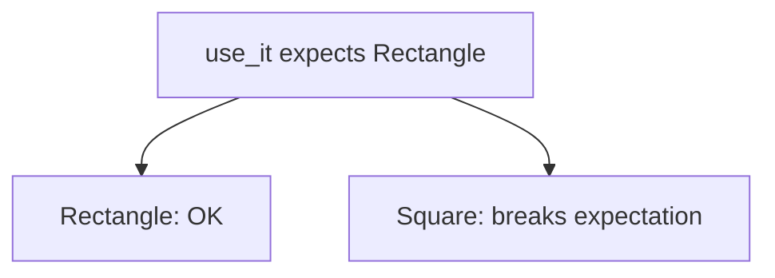

# Liskov Substitution Principle (LSP)

Subtypes must be **substitutable** for their base types.  
If code works with a `Rectangle`, it must still work correctly when given a `Square` that claims to be a `Rectangle`.

## Goal

This example shows a classic **violation**: `Square` inherits `Rectangle` but changes setter semantics. A helper written for rectangles breaks on squares.

## Concept

| Term | Meaning |
|------|---------|
| **Substitution** | Anywhere a base type is expected, a subtype can be used |
| **Contract** | Assumptions callers make about base behavior |
| **LSP** | Subtypes must honor that contract — not surprise callers |

If setting `height` on a `Rectangle` should only change height, a subtype must not also rewrite `width`.

## Violation — Square is-a Rectangle?

```python
class Square(Rectangle):
    @Rectangle.width.setter
    def width(self, value):
        self._width = self._height = value  # also changes height

    @Rectangle.height.setter
    def height(self, value):
        self._height = self._width = value  # also changes width
```

`use_it` assumes: keep width, set height to 10, area = `width * 10`.  
For `Square(5)`, setting height also sets width → area becomes `10 * 10`, not `5 * 10`.

## This example

| Piece | Role |
|-------|------|
| `Rectangle` | Independent width / height |
| `Square` | Forces equal sides via setters (breaks Rectangle contract) |
| `use_it` | Client that trusts Rectangle semantics |



Source: [`main.py`](main.py)

## Run

```bash
uv run lsp
```

### Expected output (shape)

```text
Expected: 20, Actual: 20
Expected: 50, Actual: 100
```

First line: `Rectangle(2, 3)` — OK.  
Second: `Square(5)` — mismatch → LSP broken.

## Better direction (not in this file yet)

- Don’t model square as a mutable rectangle subtype, **or**
- Share a read-only shape interface without independent setters, **or**
- Keep `Square` and `Rectangle` as siblings under a common `Shape` with `area`

## Takeaway

- Inheritance is not just code reuse — it is a behavioral promise  
- If the subtype can’t honor the parent’s contract, don’t inherit that way  
- Prefer designs where substitution keeps callers correct  

## Next

Other SOLID tutorials live as siblings under `solid/` (SRP, OCP, ISP, DIP).
