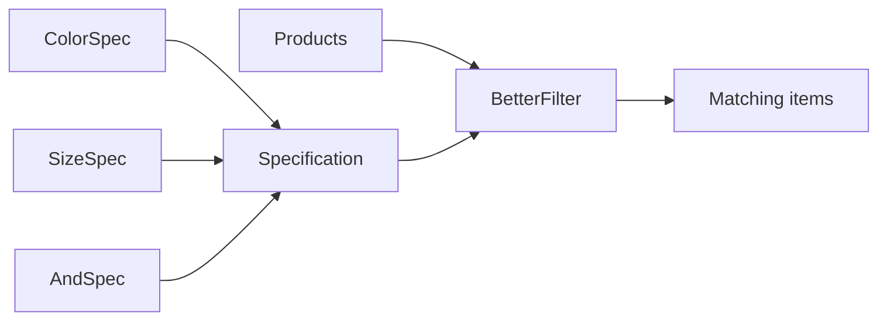

# Open/Closed Principle (OCP)

Software entities should be **open for extension** but **closed for modification**.  
Related idea: **Specification** — new filter rules as new classes, not edits to a god filter.

## Goal

Add new ways to filter products **without changing** existing filter code.  
`BetterFilter` + `Specification` subclasses stay stable; you extend by adding specs.

## Concept

| Term | Meaning |
|------|---------|
| **Open for extension** | Add behavior (new classes / specs) |
| **Closed for modification** | Don’t keep editing old classes for each new case |
| **Specification** | An object that answers “does this item match?” |

If you need “filter by weight”, you add `WeightSpecification` — you don’t reopen `ProductFilter` and bolt on another method.

## Bad vs Good

### Violation — combinatorial methods on `ProductFilter`

```python
class ProductFilter:
    def filter_by_color(self, products, color): ...
    def filter_by_size(self, products, size): ...
    def filter_by_size_and_color(self, products, size, color): ...
    # next week: filter_by_weight, filter_by_size_and_weight, ...
```

Every new criterion (or combination) means **modifying** `ProductFilter`. Combinations explode.

### Compliant — this tutorial

```python
class Specification:
    def is_satisfied(self, item): ...

class ColorSpecification(Specification): ...
class SizeSpecification(Specification): ...
class AndSpecification(Specification): ...

class BetterFilter:
    def filter(self, items, spec):
        return [item for item in items if spec.is_satisfied(item)]
```

New rule → new `Specification` subclass. `BetterFilter` stays closed.

## This example

| Piece | Role |
|-------|------|
| `Product` | Name, color, size |
| `ProductFilter` | Old approach (violation) |
| `Specification` | Abstract match rule (+ `__and__` for compose) |
| `ColorSpecification` / `SizeSpecification` | Concrete rules |
| `AndSpecification` | Combine rules |
| `BetterFilter` | Apply any spec to a list |



Source: [`main.py`](main.py)

## Run

From the repo root:

```bash
uv run ocp
```

Or:

```bash
uv run python -m solid.open_closed.main
```

### Expected output (shape)

```text
Green products (old):
 - Apple is green
 - Tree is green
Green products (new):
 - Apple is green
 - Tree is green
Large products:
 - Tree is large
 - House is large
Large blue products:
 - House is large and blue
```

## Takeaway

- Don’t grow one filter class with every new criterion  
- Encode criteria as objects you can compose  
- Extend by adding classes; keep the filter engine closed  

## Next

Other SOLID tutorials live as siblings under `solid/` (SRP, LSP, ISP, DIP).
