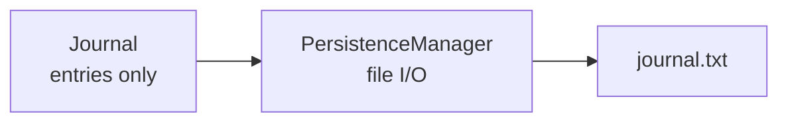

# Single Responsibility Principle (SRP)

A class should have **one primary reason to change**.  
Related idea: **Separation of Concerns (SOC)** — keep different kinds of work in different places.

## Goal

`Journal` owns diary entries.  
`PersistenceManager` owns saving to disk.  
Neither class does the other's job.

## Concept

| Term | Meaning |
|------|---------|
| **Responsibility** | A reason the class would need to change |
| **SRP** | One class → one kind of reason to change |
| **SOC** | Split domain logic from infrastructure (e.g. file I/O) |

If you change *how entries are stored in memory*, only `Journal` should move.  
If you change *how journals are written to disk*, only `PersistenceManager` should move.

## Bad vs Good

### Violation — persistence inside `Journal`

```python
class Journal:
    def add_entry(self, text): ...
    def save(self, filename):   # second responsibility
        with open(filename, "w") as f:
            f.write(str(self))
```

Now `Journal` changes for two reasons: entry rules **and** file format / I/O.

### Compliant — this tutorial

```python
class Journal:
    def add_entry(self, text): ...
    def remove_entry(self, index): ...
    # no save / load here

class PersistenceManager:
    @staticmethod
    def save_to_file(journal, filename):
        with open(filename, "w") as f:
            f.write(str(journal))
```

`PersistenceManager` is the **fix**, not the violation.

## This example

| Class | Responsibility | Methods |
|-------|----------------|---------|
| `Journal` | Manage entries | `add_entry`, `remove_entry`, `__str__` |
| `PersistenceManager` | Persist a journal | `save_to_file` |



Source: [`main.py`](main.py)

## Run

From the repo root:

```bash
uv run srp
```

Or:

```bash
uv run python -m solid.single_responsibility.main
```

### Expected output (shape)

```text
0: I cried today.
1: I ate a bug.
Saving journal to file...
Journal saved to .../solid/single_responsibility/journal.txt
File contents:
0: I cried today.
1: I ate a bug.
Success: Journal file was saved and read.
```

The file is written next to `main.py` as `journal.txt`.

## Takeaway

- Domain object → business data and behavior  
- Persistence helper → how that data is stored  
- Mixing them couples your model to the filesystem and multiplies reasons to change

## Next

Other SOLID tutorials can live as siblings under `solid/` (OCP, LSP, ISP, DIP).
